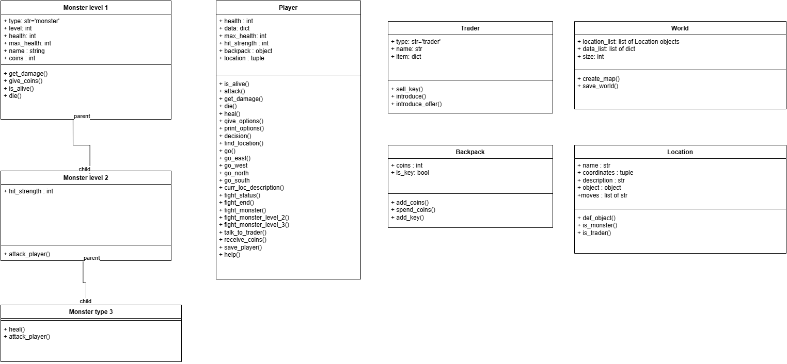

## Author
Wiktoria Małażewska

## Description
This is a text adventure game. The purpose of this game is to:
- search the world
- have enough coins to buy end-game key
- find and kill monsters (than you receive coins form them)
- find the trader and buy the end-game key from him
 This game enables saving the game and than playing the last saved game. When deciding your move you can type help to see again the game synopsis and you will recive an option to save your current game.
## Installation

## Usage
To start the game simply run the main file.

## class diagram
